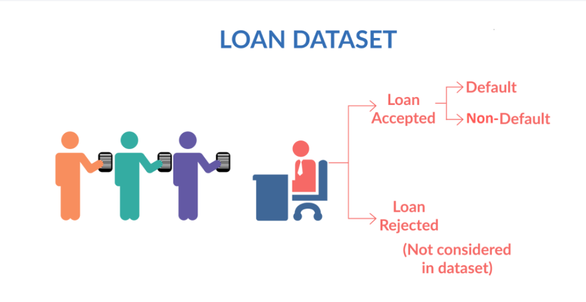

# Lending Club Case Study
> The goal of this project is to use Exploratory data analysis to to identify risky loan applicants and understand factors that contribute to a loan default

## Table of Contents
* [General Info](#general-information)
* [Steps](#general-information)
* [Libraries Used](#technologies-used)
* [Conclusions](#conclusions)
* [Contributors](#acknowledgements)

<!-- You can include any other section that is pertinent to your problem -->

## General Information

 A consumer finance company specialises in lending various types of loans to urban customers.When the company receives a loan application, the company has to make a decision for loan approval based on the applicant’s profile.There are two types of risks are associated with the bank’s decision:
* If the applicant is likely to repay the loan, then not approving the loan results in a loss of business to the company.
* If the applicant is not likely to repay the loan, i.e. he/she is likely to default, then approving the loan may lead to a financial loss for the company
The project ais to identify patterns which indicate if a person is likely to default, which may be used for taking actions such as denying the loan, reducing the amount of loan, lending (to risky applicants) at a higher interest rate, etc.
When a person applies for a loan, there are two types of decisions that could be taken by the company:
    * Loan accepted: If the company approves the loan, there are 3 possible scenarios described below:
        * 1.Fully paid: Applicant has fully paid the loan (the principal and the interest rate)
        * 2.Current: Applicant is in the process of paying the instalments, i.e. the tenure of the loan is not yet completed. These candidates    are not labelled as 'defaulted'.
        * 3.Charged-off: Applicant has not paid the instalments in due time for a long period of time, i.e. he/she has defaulted on the loan
    * Loan rejected: The company had rejected the loan (because the candidate does not meet their requirements etc.).

<!-- You don't have to answer all the questions - just the ones relevant to your project. -->

## Steps:
- Data Understanding 
- Data Cleaning
- Univariate analysis
- Bivariate analysis

## Libraries Used
- Pandas - version 1.4.1
- matplotlib - version 3.4.3
- seaborn  - version 0.11.2

<!-- As the libraries versions keep on changing, it is recommended to mention the version of library used in this project -->

## Conclusions
- Conclusion 1 from the analysis
- Conclusion 2 from the analysis
- Conclusion 3 from the analysis
- Conclusion 4 from the analysis

<!-- You don't have to answer all the questions - just the ones relevant to your project. -->

## Contributors
* Phuc Thanh Nguyen
* Aishwarya K Shetty

Developed as part of the Exloratory Data Analysis Module required for Post Graduate Diploma in Machine Learning and AI - IIIT,Bangalore.

